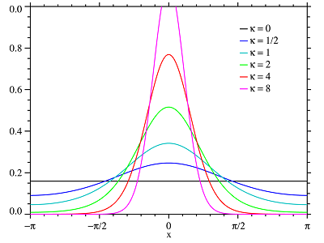

Hidden Markov Model
================
Farid Cheraghi
2023-11-08

# Intro

We have used the hidden Markov chain to estimate the probability of the
animal being in each state. Hidden Markov chain is also helpful when we
include covariates. Incorporating covariates, if there is any
correlation with the movement metrics (step-length and turn-angle),
improves the model fitting and behavioral estimation; it also provides
us with the transitional probability matrices per covariate.

# Movement metrics

In the top row of the following figure, time series of step-length and
turn-angle are shown. The step-length are in km and they have been
divided by *8h*, the time-interval of GPS observations, this the
step-lengths also exhibit *speed* time series. In the bottom row,
histograms are being shown; they follow their natural distribution and
the step-length could be fitted a Gamma and the turn-angle could be
fitted a Von-Mises distribution.

# Model fitting

Wind direction is the only circular covariate in the list of our
covariates. Circular statistics generally don’t have magnitude,
i.e. wind direction of 350 degree, is not much different from wind
direction of 10 degree. In order to introduce magnitude to wind
direction, we have used cosine of wind direction instead. Cosine or
Sine, take the periodicity of the statistics into account and therefore
`cos(350)` is very close to `cos(10)`. However the cosine of 90 degree
is not different from cosine 270, thus we have also computed the sine of
the wind direction and added it as covariate.

Wind direction is reported by meteorological organizations by the
direction from which it originates. For example, a northerly wind blows
from the north to the south. Wind direction is usually reported in
cardinal directions or in azimuth degrees. For example, a wind coming
from the south is given as 180 degrees; one from the east is 90 degrees.

For other covariates we have included only the covariate itself and
avoided to compute additional covariates such as second order
polynomials or logarithm. The reason is that the fitting of HMM models
doesn’t converge when we include these additional covariates.

## Initial parameters

The choice of initial values is very critical for the HMM model to
converge; it is important that the initial values to be as close as
possible to their actual (estimated) values. There are many density
functions that could characterize the distribution of movement metrics
including gamma, weibell, exponential and chi-square for step-length and
von-mises and wrapped-cauchy for the turn-angle distribution. gamma is
the most general distribution and other distribution such as exponential
or chi-square are the special cases for gamma. von-mises is the circular
version of normal distribution and perfectly characterizes the
turn-angle distribution. In the best case scenario of 2 states model,
where movement metrics exhibit huge contrast, the per state densities
are shown in the following illustration. In this graph, state 1 is the
resting mode also known as range-resident mode and the state 2 is the
moving mode (transient mode). In the resting mode the animal has shorter
step-lengths which are accumulated near zero and turn-angles have
roughly uniform distribution and their mean is zero. In the moving mode,
the animal has larger step-lengths and thus gamma density has a larger
mean and the density is skewed to the right to accommodate larger
step-lengths; turn-angles have mean zero and a large concentration
(small variance) that shows the directional movement in this mode.

In the rest of this document, state 1 and resting state, state 2 and
moving state are used interchangeably.


### Step-length

The mean-variance parameterization is being used for gamma instead of
more common shape-rate parameterization as it is more intuitive to
reason about and relate to the step-length. A good practice to choose
the initial mean and variance for the gamma distribution is to plot the
step-length histogram and then overlay the density of gamma distribution
using various mean and variance values to make it as close as possible
to the gamma density shown in the above image. With the case of cheetah
step-length, after a few trial and error, I found the following values
as the best initial values for step-length gamma distribution:

|         | Mean | Standard deviation |
|:-------:|:----:|:------------------:|
| State 1 | 0.1  |        0.1         |
| State 2 | 0.5  |        0.3         |

Initial values chosen for gamma distribution of cheetah step-length

``` r
# invisible(futils::par_fav())
# load ch1 windspeed hmm model
hist(ch1_hmm_windspeed$data$step,
  freq = F, col = "gray", xlab = 'Step-length (Km)',
  xlim = c(0, 12), #ylim= c(0,1),
  main = "")

curve(moveHMM:::dgamma_rcpp(x,.1,.1),0,20,col=1,add=T,lwd=2) #state 1
curve(moveHMM:::dgamma_rcpp(x,.5,.3),0,20,col=2,add=T,lwd=2) #state 2
legend("topright",legend=c("State 1","State 2"),lwd=2,col=1:2)
```

<div class="figure" style="text-align: center">


<p class="caption">
Superimposition of gamma density function on step-length histogram with
various mean and standard deviation values to choose initial values
</p>

</div>

It is also better to introduce variation to the initial values. Due to
the numerical instability, in the model selection procedure, one fixed
initial value may not work and the model fitting won’t converge. We have
introduced random variation using normal distribution with a relatively
small variance (0.1) to the initial values to overcome this situation.

``` r
mu0 <- c(rnorm(1,.1,sd=.1),rnorm(1,.5,sd = .1))    #initial mu of State 1, State 2
sigma0 <- c(rnorm(1,.1, sd=.1),rnorm(1,.3, sd=.1)) #initial sigma of State 1, State 2
```

If some steps are exactly equal to zero, then strictly positive
distributions such as the gamma are inadequate. In such cases,
zero-inflated distributions can be considered. A zero-inflated step
length distribution simply assumes that there is a probability z of
observing a 0 and a probability of (1−z) of observing a positive value
distributed according to a standard positive distribution (e.g. a
gamma). In that case the (state-dependent) values z will be estimated,
with the remaining positive distribution, weighted by (1−z), specified
as one of the available standard step length distributions ([Patterson
et al. 2009](#ref-patterson09); [Langrock et al.
2012](#ref-langrock12)). We have excluded the zero-step length before
model fitting and therefore set the *zero mass* equal to 0.

### Turn-angle

Model fitting convergence is not very much sensitive to the turn-angle
initial values compared to step-length. Turn-angle means are set to zero
and kept fixed for both states and only concentration ($\kappa$)
parameter of Von Mises is being estimated where the initial values are
set to 1 for moving state and set to a value near zero (0.1) for resting
state.  


## Additional terms

We have computed additional terms to undertake a thorough model
selection procedure. Individual covariates (12) along with their square
root , logarithm, cosine of angle variables (“wind direction”) and 2nd
order polynomials are added as additional covariates. All possible
interactions of the main effects are also used in the model fitting
process. To avoid further complexity, we have assumed the relation is
linear and additive. For example, we have models of this type:

$${\beta _0} + {\beta _1}\cos (wind\_direction) + {\beta _2}height + {\beta _3}heigh{t^2} + {\beta _5}temperature . elevation$$

| Main Effects | Square Root | Logarithm | Angle Cosine | Polynomials | Interaction | Sum |
|--------------|-------------|-----------|--------------|-------------|-------------|-----|
| 12           | 12          | 12        | 2            | 24          | 12          | 74  |

List of additional covariates computed from main effects

So we have 74 covariates that we have to build our model on. Definitely,
the best automatic approach would be “best subset selection” that takes
every possible combination of covariates and compares the models
performance, i.e. using AIC values. However, for $n=74$,
$2^n = 1.9 \times {10^{22}}$ models will be computed which is not
reasonable. Instead we have opted for the “forward step wise selection”
which will not find the best possible model, rather a parsimonious model
close to the best model. forward step wise selection procedure reduces
the number of models to be evaluated to about $n^2 = 5476$, which can be
done using a modern computer in a fair amount of time.

## Forward step-wise selection

We have implemented the “forward step wise selection” to select the best
set of covariates. The pseudo-code is as the following algorithm:

| Forward step wise selection (FSWS) algorithm ([James et al. 2013](#ref-james13))                  |
|:--------------------------------------------------------------------------------------------------|
| 1\. Let $M_0$ denote the null model, which contains no predictors.                                |
| 2\. For $k=0,...,p-1$:                                                                            |
| i\) Consider all $p-k$ models that augment the predictors in $M_k$ with one additional predictor. |
| ii\) Choose the best among these $p-k$ models, and call it $M_{k+1}$.                             |
| Here best is defined as having highest likelihood (MLE) value.                                    |
| 3\. Select a single best model from among $M_0,...,M_p AIC$.                                      |

## Result

The result of FSWS leads to a few models that outperform the null model.
The best model, in terms of AIC values, is the model with
`~wind_speed + city_dist` covariates. The `~1` is the null model without
any covariate in the following table. The third column in this table is
the agreement of the states estimated using Viterbi algorithm against
the null model states estimation.

| Name                             | AIC    | State-agreement |
|----------------------------------|--------|-----------------|
| \~wind_speed+city_dist           | 980.56 | 0.93            |
| \~wind_speed                     | 981.41 | 0.97            |
| \~wind_speed+elevation+city_dist | 981.79 | 0.92            |
| \~wind_speed+elevation           | 982.89 | 0.97            |
| \~1                              | 986.64 | 1.00            |

AIC values of models that outperform null model

## Goodness of fit

Pseudo-residuals are suitable to check the goodness of fit for time
series model like hidden Markov chain. The pseudo-residuals (PR) of the
step-lengths and turn-angles could be computed from output of hidden
Markov model. On the other hand, Jarque-bera test statistics, tests the
null of normality for x (step-length and turn-angle). Running the test
on the PR of the best model (`~wind_speed + city_dist`), shows that the
PR of step-length violates the normality assumption (p-value = 0.03662)
within 95% confidence interval and thus is not a good model. By choosing
the next available model in terms of AIC and computing the Jarque-bera
statistics, we see the step-length p-value (0.05093) is not significant
within 95% confidence interval. So we choose this simple model with only
wind speed covariate as our best model.

``` r
# jarque bera test for noramlity of step-length and turn-angle pseudo residuals
ch1_hmm_windspeed %>%
moveHMM::pseudoRes() %$%
  list(
    step = tseries::jarque.bera.test(stepRes[complete.cases(stepRes)]),
    angleRes = tseries::jarque.bera.test(angleRes[complete.cases(angleRes)])
  )
```

    ## $step
    ## 
    ##  Jarque Bera Test
    ## 
    ## data:  stepRes[complete.cases(stepRes)]
    ## X-squared = 5.8747, df = 2, p-value = 0.05301
    ## 
    ## 
    ## $angleRes
    ## 
    ##  Jarque Bera Test
    ## 
    ## data:  angleRes[complete.cases(angleRes)]
    ## X-squared = 1.4284, df = 2, p-value = 0.4896

``` r
moveHMM::plotPR(ch1_hmm_windspeed)
```

    ## Computing pseudo-residuals... DONE

<div class="figure" style="text-align: center">


<p class="caption">
Time series, qq-plots, and autocorrelation functions of the
pseudo-residuals of the 2-states model.
</p>

</div>

## Coeficient 95% Confidence Intervals

The 95% confidence interval of the coefficients shows that the effect of
wind speed is only significant in the transitions from state 1 to state
2 or 1. The coefficients are estimated only for **1 \> 2** and **2 \>
1**. The coefficients for **1 \> 1** could be computed from the
coefficients of **1 \> 2** and the coefficients for **2 \> 2** could be
computed from coefficients of **2 \> 1**. They follow this simple
formula:

$$\begin{array}{*{20}{c}}
{{P_{1 > 1}} = 1 - {P_{1 > 2}}}&{,}&{{P_{2 > 2}} = 1 - {P_{2 > 1}}}
\end{array}$$

``` r
hmm_plot_CI(ch1_hmm_windspeed)
```

<div class="figure" style="text-align: center">


<p class="caption">
95% confidence interval of the coefficient estimes shows that only the
`wind_speed` is significant when transitioning from state 1 to state 1
or 2
</p>

</div>

The wind speed only affects the probabilities from the resting state.
Animals that are resting are more likely to stay resting when the wind
is high, and likewise less likely to start moving when the wind is high.
However it is interesting that there is no significant (or even
suggestive) effect of wind speed on animals that are already moving.
That may speak to the pre-eminence of their motivation to be moving
(e.g. hunger, looking for food etc) despite conditions.

# Best model

The output of the model confirms that the initial parameters value have
been selected wisely due to their closeness to the estimated values. The
only regression coefficient for the transition probabilities that is
robust and could be interpreted is the wind speed for transition from
state 2 to state 1 or 2. The negative values implies that the
probability of switching from moving to resting state decreases as wind
speed increases. Likewise, the probability of staying in moving state
(2) increases as the wind speed increases.

``` r
print(ch1_hmm_windspeed)
```

    ## Value of the maximum log-likelihood: -477.7144 
    ## 
    ## Step length parameters:
    ## ----------------------
    ##         state 1   state 2
    ## mean 0.05961488 0.3859205
    ## sd   0.09799240 0.2971999
    ## 
    ## Turning angle parameters:
    ## ------------------------
    ##                    state 1   state 2
    ## mean          0.000000e+00 0.0000000
    ## concentration 1.397111e-08 0.9691988
    ## 
    ## Regression coeffs for the transition probabilities:
    ## --------------------------------------------------
    ##                1 -> 2      2 -> 1
    ## intercept  -0.4156253 -1.84277685
    ## wind_speed -1.2858882  0.05902679
    ## 
    ## Initial distribution:
    ## --------------------
    ## [1] 2.37909e-10 1.00000e+00

## Model plot

Histogram of step lengths with fitted distributions (top-left),
histogram of turning angles with fitted distributions (top-right),
transition probabilities as functions of wind_speed (bottom-left), and
map of decoded track for the cheetah (bottom-right) are shown below:

``` r
plot(ch1_hmm_windspeed, ask=FALSE)
```

    ## Decoding states sequence... DONE


## States plot

In the following illustration the estimated probability of being in each
state is shown. The actual states (1,2) could be computed using two
approaches:

1.  Viterbi: Reconstructs the most probable states sequence, using the
    Viterbi algorithm ([Zucchini and MacDonald 2009](#ref-zucchini09)).
    The result of Viterbi is shown in the top row of the following
    illustration.
2.  Conditional statement: In this method, if the probability of being
    in state 1 is more than a threshold i.e. 0.5, then the animal is in
    state 1.

``` r
# states
moveHMM::plotStates(ch1_hmm_windspeed, ask=FALSE)
```

    ## Decoding states sequence... DONE
    ## Computing states probabilities... DONE

<div class="figure" style="text-align: center">


<p class="caption">
Decoded states sequence (top row), and state probabilities of
observations (middle and bottom rows)
</p>

</div>

# Reference

<div id="refs" class="references csl-bib-body hanging-indent">

<div id="ref-cheraghi17" class="csl-entry">

Cheraghi, Faridedin, Mahmoud Reza Delavar, Farshad Amiraslani, Kazem
Alavipanah, Eliezer Gurarie, and William F. Fagan. 2017. “Statistical
Analysis of Asiatic Cheetah Movement and Its Spatio-Temporal Drivers.”
*Journal of Arid Environments*.

</div>

<div id="ref-james13" class="csl-entry">

James, Gareth, Daniela Witten, Trevor Hastie, and Robert Tibshirani.
2013. *An Introduction to Statistical Learning: With Applications in r*.
1st ed. 2013, Corr. 6th printing 2016 edition. Springer.

</div>

<div id="ref-langrock12" class="csl-entry">

Langrock, Roland, Ruth King, Jason Matthiopoulos, Len Thomas, Daniel
Fortin, and Juan M. Morales. 2012. “Flexible and Practical Modeling of
Animal Telemetry Data: Hidden Markov Models and Extensions.” *Ecology*
93 (11): 2336–42. <https://doi.org/10.1890/11-2241.1>.

</div>

<div id="ref-patterson09" class="csl-entry">

Patterson, Toby A., Marinelle Basson, Mark V. Bravington, and John S.
Gunn. 2009. “Classifying Movement Behaviour in Relation to Environmental
Conditions Using Hidden Markov Models.” *Journal of Animal Ecology* 78
(6): 1113–23. <https://doi.org/10.1111/j.1365-2656.2009.01583.x>.

</div>

<div id="ref-zucchini09" class="csl-entry">

Zucchini, Walter, and Iain L. MacDonald. 2009. *Hidden Markov Models for
Time Series: An Introduction Using r*. CRC Press.

</div>

</div>
